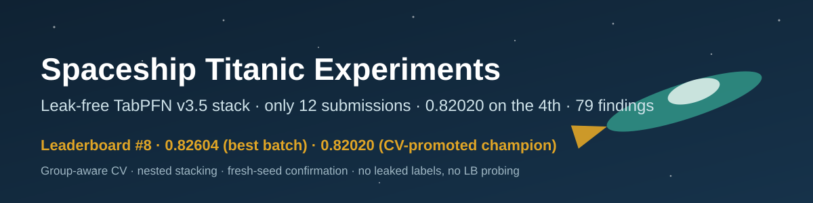
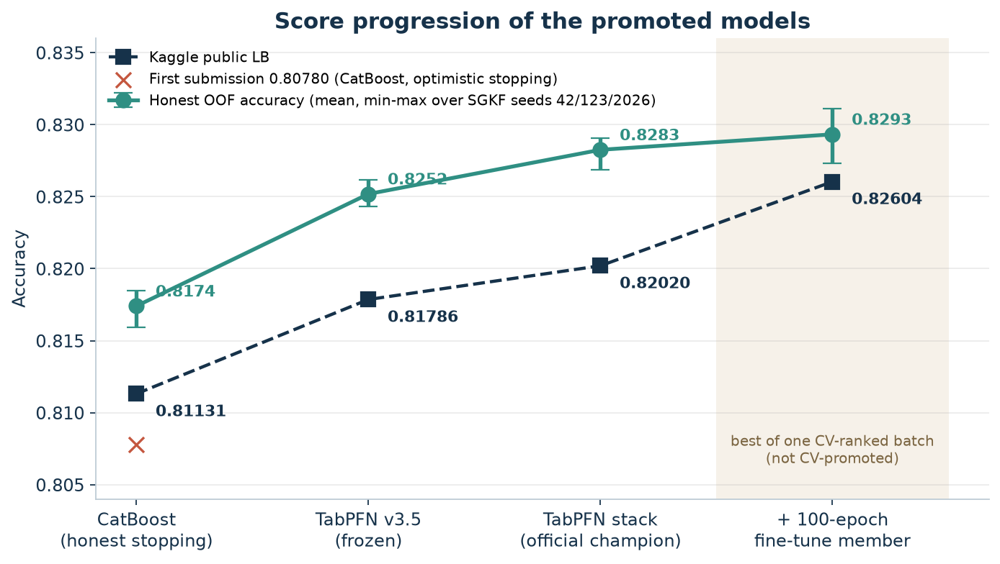
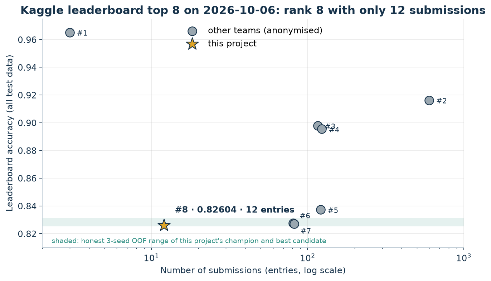
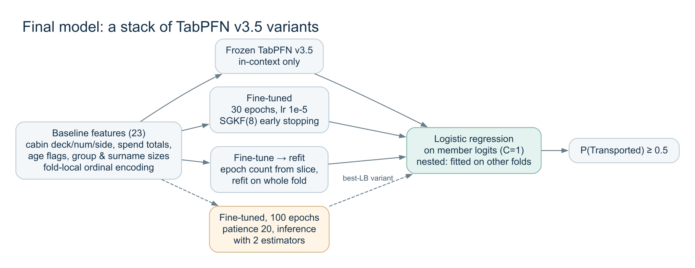
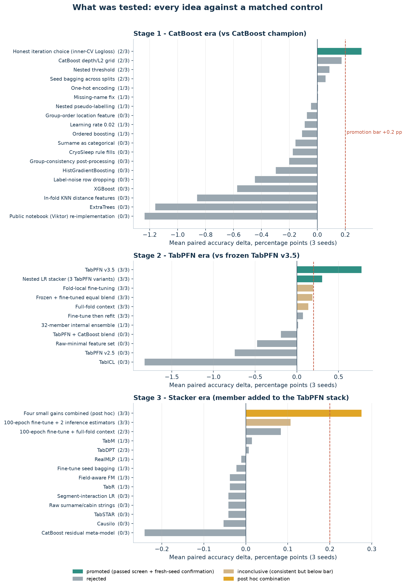

# Kaggle Spaceship Titanic Experiments

Spaceship Titanic — predict whether a passenger was transported to another dimension (`Transported`).



Kaggle Notebook: [Spaceship Titanic · Leak-free TabPFN v3.5 Fine-tuning Stack](https://www.kaggle.com/code/taeyangg4/spaceship-titanic-leak-free-tabpfn-fine-tuning-stack) (to be published)

[한국어](README.md) / [Experiment journey (KO)](docs/02-experiment-journey.md) / [Validation and integrity (KO)](docs/03-validation-and-integrity.md) / [Reproduction (KO)](docs/05-reproduction.md)

## About

A Kaggle practice project run by several AI coding agents (Codex, Claude Code, ChatGPT) that shared one research protocol: a scored hypothesis queue, one recorded finding per experiment (failures included), cross-host review of every finding, and a durable handoff log. A human set the goal and rules and approved installs and submissions; the agents picked the highest-priority hypothesis, wrote the code, ran it on a local GPU and recorded the result.

The rule was fixed from day one: **no recovered labels, no leakage, no leaderboard probing — only honest validation.** Only **12 submissions** were made in total. The CV-promoted champion reached **0.82020 on the 4th submission**; the best of a final, single batch of CV-ranked candidates scored **0.82604**.

## Results

| Item | Record |
|---|---|
| First submission | CatBoost baseline, public **0.80780** |
| Official champion (promoted by the CV rule) | Nested stack of three TabPFN v3.5 variants, public **0.82020** (4th submission) |
| Best submission (best of one CV-ranked batch of 8) | Champion stack + 100-epoch fine-tuned member, public **0.82604** |
| Honest OOF accuracy, official champion | 0.8291 / 0.8288 / 0.8269 (SGKF seeds 42 / 123 / 2026) |
| Recorded findings | 78, including negative results |
| Submissions | **12 in total** (2026-10-05 to 10-06 UTC) |
| Leaderboard rank | **8th** on 2026-10-06 with 12 entries; the teams ranked 6th and 7th used 81 and 82 |



The leaderboard of this competition is **calculated on all of the test data**, so the public score is the full test accuracy; there is no hidden private split. The top four scores (0.895–0.965) are far above anything validated in this project (best honest OOF ≈ 0.831); individual entries cannot be verified, so no judgement is made about them.



## Achieved with standard, leak-free methods only

| Risk | What this project did |
|---|---|
| Leaked or recovered test labels | **Never used.** No external answer files, no other people's submission CSVs, no "best public override" bits embedded in notebooks (high-scoring public notebooks that do this were audited and excluded). |
| Leaderboard probing | **None.** 12 submissions in total; 0.81786 was the 3rd and 0.82020 the 4th, each submitted once after passing CV. The last 8 candidates were ranked by CV and submitted once, together. No submission was used to infer labels or to choose features, hyperparameters or rows. |
| Validation leakage | StratifiedGroupKFold by travel group (`PassengerId` prefix); train and test share **0** groups. Encoders, early-stopping slices and epoch choices are fitted inside the training fold; the stacker for fold *k* uses only the other folds' OOF. |
| Optimistic CV | Early stopping on the scored fold inflated accuracy by ~0.004; it was found and **removed**. |
| Overfitting to a split | Every idea had to beat a matched control on 3 split seeds (mean ≥ +0.002, ≥ 2/3 positive), then on 2 fresh seeds (7, 99). Only 3 of the 44 ledger entries were promoted. |
| External data | None besides pretrained TabPFN weights (synthetic-data pretraining, no Spaceship Titanic labels). |

Stated openly: `GroupSize` and `SurnameSize` count passengers over the combined train + test **feature rows** (no labels; transductive). And 0.82604 is the best of a batch of 8, so it is reported separately from the CV-promoted 0.82020. Remaining limitations (seed reuse across the whole programme, a post hoc combination that was not confirmed, GPU nondeterminism) are listed in [docs/03](docs/03-validation-and-integrity.md).


## How it improved

1. **Fix the validation first (0.80780 → 0.81131).** Removing early stopping on the scored fold lowered OOF by ~0.004, but iterations chosen by an inner CV inside the training fold beat the new baseline on 3 + 2 seeds — and the public score rose. The lower CV was the one that transferred.
2. **Features and GBDTs hit a wall.** Missing-value semantics, CryoSleep rules, group/cabin location features, surname categories, KNN features, XGBoost/LightGBM/ExtraTrees, pseudo-labelling, label-noise handling, group post-processing and a re-implementation of the best clean public notebook all failed the rule. 66% of ever-wrong rows were wrong on ≥ 4 of 5 seeds, and confidently so.
3. **A tabular foundation model (→ 0.81786).** TabPFN v3.5 on the same features and folds gained ~+0.008 on every seed. TabPFN v2.5, TabICL, TabDPT, Causilo, TabSTAR, RealMLP, TabM and TabR were all lower and added nothing to the stack.
4. **Fine-tuning + nested stacker (→ 0.82020).** A logistic regression over the logits of frozen, fine-tuned and fine-tune-then-refit TabPFN, fitted only on other folds, gained +0.0031 and was confirmed on fresh seeds (+0.0033 / +0.0053). Its weights extrapolate along the frozen → fine-tuned direction.
5. **One batch of small gains (best 0.82604).** Candidates combining small but consistent fine-tuning gains were ranked by CV and the remaining 8 submissions were used in one batch. All 8 beat the champion, but LB order did not follow CV order, so the champion was not replaced by LB.





## Repository layout

```text
agents.md / plan.md / discoveries.md / handoff.md   research protocol, queue, 78 findings, log
docs/                     reports (Korean), charts, diagrams, evidence (submissions, ledger, hashes)
src/spaceship_titanic/    features, frozen folds, experiment utilities
scripts/                  experiment runners and audits, kept as run
configs/ reports/         experiment configs and per-run metrics (with code and data hashes)
submissions/              the 12 submitted prediction CSVs
kaggle_notebook/          self-contained Kaggle notebook and its builder
kaggle_dataset/           saved member probabilities for the notebook's replay mode (no labels)
tools/                    chart/diagram builders, evidence snapshot, publication check
```

Raw competition data, OOF prediction files, model weights and credentials are not included.

## Reproduce

```bash
git clone https://github.com/TaeyanG4/kaggle-spaceship-titanic-experiments.git
cd kaggle-spaceship-titanic-experiments
uv sync
python tools/verify_publication.py
```

Retraining needs the competition data, a TabPFN token and a GPU — see [docs/05](docs/05-reproduction.md), or run the [Kaggle notebook](kaggle_notebook/README.md). Reuse conditions: [NOTICE](NOTICE.md).
