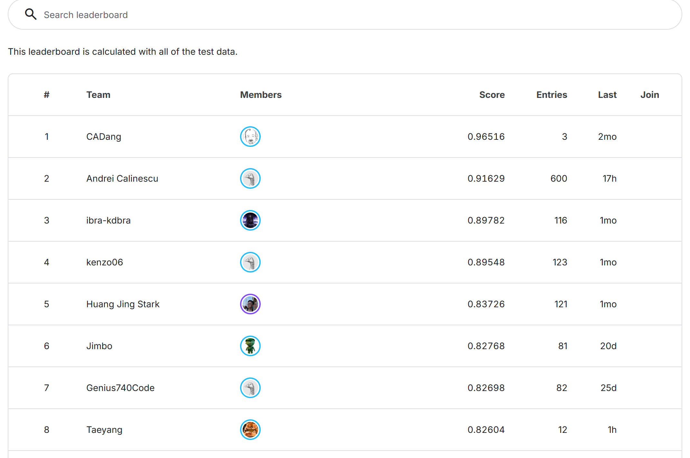
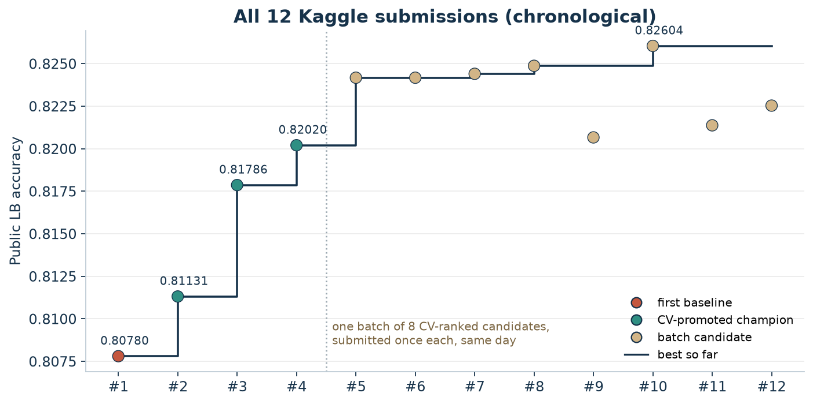

# Kaggle Spaceship Titanic Experiments

Spaceship Titanic - 승객이 다른 차원으로 이동(`Transported`)했는지 예측하는 Kaggle 대회


Kaggle Notebook: [Leak-free 2026 TabPFN Stack | Top Public 0.82604](https://www.kaggle.com/code/taeyangg4/leak-free-2026-tabpfn-stack-top-public-0-82604)

[English README](README.en.md) / [단계별 실험 기록](docs/02-experiment-journey.md) / [검증과 무결성](docs/03-validation-and-integrity.md) / [재현 방법](docs/05-reproduction.md)

## 프로젝트 소개

여러 AI 코딩 에이전트(Codex, Claude Code, ChatGPT)가 하나의 연구 규약을 공유하면서 가설을 세우고, 실험하고, 서로의 결론을 교차 검증하는 방식으로 진행한 Kaggle 연습 프로젝트다. 사람은 목표와 규칙을 정하고 제출을 승인했고, 에이전트는 계획 큐에서 우선순위가 가장 높은 가설을 골라 코드를 작성하고 로컬 GPU에서 실행한 뒤 결과를 기록했다.

처음부터 **"정답 조회, 데이터 누출, 리더보드 탐색 없이 정석적인 검증만으로 점수를 올린다"** 를 규칙으로 고정했다. 제출은 전체 **12번뿐**이었고, 공식 챔피언 0.82020은 **4번째 제출**이었다. 리더보드 점수를 보며 고친 것이 아니라, 로컬 CV에서 결정한 모델을 한 번씩만 제출했다는 뜻이다. 그 결과 첫 제출 0.80780에서 출발해, CV 규칙으로 승격된 공식 챔피언은 **0.82020**, 마지막에 CV 순위대로 한 번에 제출한 후보 중 최고는 **0.82604** 를 기록했다. 성공한 실험뿐 아니라 실패한 아이디어 수십 개와 그 이유도 모두 남겼다.

## 결과

| 항목 | 기록 |
|---|---|
| 최초 제출 | CatBoost 기준선, Public **0.80780** |
| 공식 챔피언 (CV 규칙으로 승격) | TabPFN v3.5 변형 3종의 nested 스택, Public **0.82020** |
| 최고 제출 (CV 순위 후보 8개 일괄 제출 중 최고) | 위 스택 + 100에폭 파인튜닝 멤버, Public **0.82604** |
| 정직한 OOF 정확도 (공식 챔피언) | 0.8291 / 0.8288 / 0.8269 (SGKF seed 42 / 123 / 2026) |
| 기록된 발견 (discovery) | 79건, 실패한 가설 포함 |
| 실제 제출 수 | **단 12건** (2026년 10월 5~6일 UTC). 이후 Kaggle 노트북에 점수를 붙이려고 같은 파일을 노트북 출력으로 한 번 더 제출(0.82604) |
| 제출 효율 | 3번째 제출에서 0.81786, **4번째 제출에서 0.82020**. 그 사이 제출은 모두 CV 규칙을 통과한 챔피언 1개씩 |
| 리더보드 순위 | **8위** (2026-10-06 기준, 12회 제출). 바로 위 6·7위 팀은 81회·82회 제출 |

수치는 [제출 기록](docs/evidence/kaggle-submissions.csv), [실험 원장](docs/evidence/experiment-ledger.csv)과 [발견 기록](discoveries.md)에서 확인할 수 있다.


이 대회의 리더보드는 **test 데이터 전체로 계산**된다. 따라서 public 점수가 곧 test 전체 정확도이고, 따로 숨겨진 private 점수는 없다. 상위 4개 팀의 0.895–0.965는 이 프로젝트에서 검증한 어떤 모델의 정확도(정직한 OOF 최대 약 0.831)보다 훨씬 높다. 개별 제출의 방법은 확인할 수 없으므로 판단하지 않는다.



공개 리더보드 화면이다 (로그인하지 않은 상태로 [`tools/leaderboard-capture`](tools/leaderboard-capture/capture.mjs)로 촬영). 같은 데이터를 제출 횟수와 함께 그리면 아래와 같다.


## 정석적인 방법으로만 달성했다

이 프로젝트의 모든 점수는 아래 경계 안에서 만들어졌다. 자세한 근거와 남은 한계는 [검증과 무결성](docs/03-validation-and-integrity.md)에 정리했다.

| 위험 | 이 프로젝트에서 한 일 |
|---|---|
| 정답 유출·복구된 test 라벨 | **사용하지 않음.** 외부 정답 파일, 다른 사람의 제출 CSV, 노트북에 박힌 "best public override" 비트를 쓰지 않았다. 고득점 공개 노트북 중 이런 방식을 쓰는 사례는 감사 후 제외했다. |
| 리더보드 탐색 (LB probing) | **하지 않음.** 전체 제출이 12번이고, 0.81786은 3번째, 0.82020은 4번째 제출이다. 제출 점수로 라벨을 추론하거나 피처·하이퍼파라미터·행을 고르지 않았다. 챔피언 3개는 CV 규칙을 통과한 **뒤에** 한 번씩만 제출했고, 마지막 후보 8개는 CV 순위대로 **한 번에** 제출했다. |
| 검증 누출 | 여행 그룹(`PassengerId` 앞 4자리) 단위 **StratifiedGroupKFold**. 그룹은 fold를 넘지 않고, train과 test는 그룹을 하나도 공유하지 않는다. 인코더, 조기종료 slice, 에폭 선택은 모두 학습 fold 안에서만 정했다. |
| 낙관적인 CV | 채점 fold로 조기종료하던 초기 방식이 정확도를 약 0.004 부풀린다는 것을 발견하고 **제거**했다. 스태커도 fold *k* 를 예측할 때 나머지 4개 fold의 OOF로만 학습했다 (nested). |
| 한 split에 대한 과적합 | 모든 아이디어는 같은 조건의 대조군과 **3개 split seed** 에서 비교했다 (평균 +0.002 이상, 3개 중 2개 이상 개선). 통과하면 선택에 쓰지 않은 **새 seed 2개** (7, 99)에서 다시 확인했다. [실험 원장](docs/evidence/experiment-ledger.csv)의 44건 중 승격된 것은 3건뿐이다. |
| 외부 데이터 | 사전학습된 TabPFN 가중치 외에는 없음. TabPFN은 합성 데이터로 사전학습된 모델이며 Spaceship Titanic 라벨을 포함하지 않는다. |

`GroupSize` 와 `SurnameSize` 는 train과 test의 **입력 행을 합쳐서** 센다 (라벨은 쓰지 않는 transductive 계산). 그리고 0.82604는 CV 순위 후보 8개를 한 번에 제출한 결과 중 **최고값**이므로, 규칙으로 승격된 점수(0.82020)와 구분해서 표기한다.

<p align="center">
  
</p>

## 작업 방식

[research-orchestrator-skill](https://github.com/TaeyanG4/research-orchestrator-skill) 이라는 작업 규약을 스킬로 만들어 모든 에이전트가 같은 네 파일을 공유하게 했다. `plan.md` 는 점수를 매긴 가설 큐, `discoveries.md` 는 실험마다 하나씩 남기는 발견(실패 포함), `handoff.md` 는 작업 로그와 이어받기 상태, `agents.md` 는 고정 규칙이다. 한 호스트가 만든 발견은 다른 호스트가 한 번 검증한다.

<p align="center">
  
</p>

[흐름도 원본](docs/diagrams/workflow.dot) / [확대 보기](docs/assets/workflow.svg)

## 어떻게 개선했나

### 1. 검증부터 고쳤다 (0.80780 → 0.81131)

CatBoost 기준선은 OOF 0.8188, Public 0.80780이었다. 차이를 추적하다가 **채점하는 fold로 조기종료를 하고 있었다**는 것을 찾았다. 정직한 방식으로 바꾸자 OOF는 약 0.004 떨어졌다. 그 대신 학습 fold 안의 inner-CV로 반복 수를 고르는 방식이 새 기준선을 넘었고, Public도 0.81131로 올랐다. 낮아진 CV가 오히려 리더보드와 맞는 CV였다.

### 2. 피처와 GBDT는 한계에 부딪혔다

지출 결측 의미 보정, CryoSleep 규칙, 그룹·객실 위치 피처, 성씨 범주, KNN 거리 피처, XGBoost·LightGBM·ExtraTrees, pseudo-labelling, 라벨 노이즈 제거, 그룹 후처리, 공개 고득점 노트북 재구현까지 모두 시험했지만 승격 기준을 넘은 것은 없었다. 다섯 개 seed 중 4번 이상 틀린 행이 한 번이라도 틀린 행의 66%였고, 이 행들은 0.5에서 멀리 떨어진 확률로 **자신 있게** 틀렸다. 피처가 아니라 신호의 한계에 가까웠다.

### 3. 테이블 파운데이션 모델 (0.81131 → 0.81786)

TabPFN v3.5를 같은 피처, 같은 fold로 넣자 OOF가 3개 seed 모두에서 약 +0.008 올랐다. 튜닝한 어떤 GBDT보다 컸다. 다른 파운데이션 모델(TabPFN v2.5, TabICL, TabDPT, Causilo, TabSTAR)과 딥러닝 테이블 모델(RealMLP, TabM, TabR)은 모두 이보다 낮았고 스택에도 기여하지 않았다.

### 4. 파인튜닝과 nested 스태커 (0.81786 → 0.82020)

TabPFN을 fold 안에서 파인튜닝하면 3개 seed 모두 조금씩 좋아졌지만 기준(+0.002)에는 못 미쳤다. frozen, 파인튜닝, 파인튜닝 후 refit 세 멤버의 logit을 **nested 로지스틱 회귀**로 합치자 +0.0031이 나왔고, 새 seed 7/99에서도 확인되어 승격했다. 스태커 가중치는 frozen에 음수, 파인튜닝 멤버에 양수를 주어 "파인튜닝 방향으로 한 걸음 더" 가는 형태가 됐다.


### 5. 작은 개선을 모아 한 번에 제출 (최고 0.82604)

100에폭 파인튜닝 멤버처럼 3개 seed에서 일관되지만 기준에 못 미친 개선들이 남았다. 이를 조합한 후보를 CV 순위로 정렬해 남은 제출 8회를 **한 번에** 사용했다. 8개 모두 공식 챔피언보다 높았지만 LB 순서는 CV 순서와 맞지 않았다 (같은 모델의 test 배깅 버전끼리도 0.0028 차이). 그래서 LB 최고값으로 챔피언을 바꾸지 않고, 공식 챔피언과 최고 제출을 구분해서 기록했다.



실패한 아이디어 전체와 수치는 [단계별 실험 기록](docs/02-experiment-journey.md)에 있다.


## 작업 로그와 주목할 발견

[handoff.md](handoff.md)의 작업 로그와 [discoveries.md](discoveries.md)의 발견 79건 중 흐름이 바뀐 순간과 쓸모 있는 결론만 [09. 작업 로그 하이라이트와 주목할 발견](docs/09-log-and-findings.md)에 골라 두었다. 몇 가지만 옮기면 다음과 같다.

| 시각 (한국) | 일 | 결과 |
|---|---|---|
| 10-05 17:37 | CatBoost 기준선, 1번째 제출 | LB 0.80780 |
| 10-05 23:28 | 채점 fold 조기종료가 CV를 0.004 부풀린다는 것을 발견 | 정직한 검증으로 전환 |
| 10-06 09:22 | TabPFN v3.5 승격, 3번째 제출 | LB 0.81786 |
| 10-06 13:08 | TabPFN 3종 nested 스택 승격, 4번째 제출 | LB 0.82020 |
| 10-06 14:43 | 다른 호스트의 재검토로 기존 결론(D-D-021) 뒤집힘 | CHALLENGED |
| 10-06 17:48 | CV 순위 후보 8개 일괄 제출 | 최고 0.82604, 8위 |

* train과 test는 여행 그룹을 하나도 공유하지 않는다 (D-D-004, VERIFIED).
* 채점 fold로 조기종료하면 정확도가 약 0.004 부풀려진다. 고치자 LB가 올랐다 (D-D-026/028, VERIFIED).
* 깨끗해 보이는 최고 공개 노트북(0.81833)의 정직한 OOF는 약 0.805다 (D-A-014, VERIFIED).
* 스택의 이득은 다른 모델 계열이 아니라 **같은 TabPFN의 파인튜닝 방향**에서만 나온다 (D-A-027/037).

## 문서 안내

| 문서 | 내용 |
|---|---|
| [실험 설계](docs/01-experiment-design.md) | 목표, 데이터, 검증 계약, 승격 규칙, 측정한 것과 하지 못한 것 |
| [단계별 실험 기록](docs/02-experiment-journey.md) | 단계별 가설, 설정, 수치, 실패 이유와 다음 결정 |
| [검증과 무결성](docs/03-validation-and-integrity.md) | 누출·치팅·LB probing·과적합을 막은 방법과 남은 한계 |
| [작업 방식과 에이전트](docs/04-workflow-and-agents.md) | 연구 규약, 멀티 에이전트 운영, 교차 검증 |
| [재현 방법](docs/05-reproduction.md) | 데이터 준비, 환경, 주요 실험과 최종 제출 재현 |
| [결과와 교훈](docs/06-results-and-lessons.md) | 배운 점과 후속 과제 |
| [참고 자료](docs/07-references.md) | 모델·라이브러리·공개 자료 출처 |
| [작업 로그와 주목할 발견](docs/09-log-and-findings.md) | handoff·discoveries에서 고른 흐름의 전환점과 핵심 결론 |
| [사용한 스킬](docs/08-skills.md) | research-orchestrator-skill, Kaggle 스킬의 역할·버전과 [문서 스냅샷](docs/skills/README.md) |

## 파일 구성

```text
README.md / README.en.md     프로젝트 요약
agents.md                    연구 규약 (고정 규칙)
plan.md                      남은 가설 큐
discoveries.md               실험별 발견 79건 (실패 포함, 교차 검증 기록)
handoff.md                   작업 로그, 점수 원장, 이어받기 상태
docs/                        실험 보고서
  assets/                    차트와 흐름도 이미지
  diagrams/                  흐름도 DOT 소스와 해시
  evidence/                  제출 기록, 실험 원장, 데이터·환경 지문, 스태커 계수
src/spaceship_titanic/       피처, fold, 실험 공통 코드
scripts/                     실험 러너와 감사 스크립트 (실행 당시 상태)
configs/                     실험 설정 (screen spec 포함)
reports/                     실험별 지표 JSON과 요약
submissions/                 공개한 예측 CSV 12개
kaggle_notebook/             Kaggle 노트북과 생성 스크립트
kaggle_dataset/              노트북 재생용 멤버 예측 확률 (라벨 없음)
tools/                       차트·흐름도 생성, 증거 스냅샷, 공개 검증
tests/                       단위 테스트
```

원본 Kaggle 데이터, OOF 예측 파일, 모델 체크포인트, 인증 정보는 포함하지 않았다. 실험 스크립트는 실행 당시 상태를 그대로 두었다 (러너 파일의 해시가 캐시된 실행의 지문에 들어가므로 사후 수정하지 않았다).

## 재현

```bash
git clone https://github.com/TaeyanG4/kaggle-spaceship-titanic-experiments.git
cd kaggle-spaceship-titanic-experiments
uv sync
python tools/verify_publication.py
```

검증 도구는 증거 파일의 해시와 문서 링크를 확인한다. 모델 재학습에는 Kaggle 데이터와 TabPFN 토큰, GPU가 필요하다. 절차는 [재현 문서](docs/05-reproduction.md)에, 가장 쉬운 재현 경로는 [Kaggle 노트북](kaggle_notebook/README.md)에 있다.

연구는 종료했다. 남은 가설과 이어받기 명령은 [plan.md](plan.md)와 [handoff.md](handoff.md)에 남겨 두었다. 재사용 조건은 [NOTICE](NOTICE.md)를 참고하면 된다.
