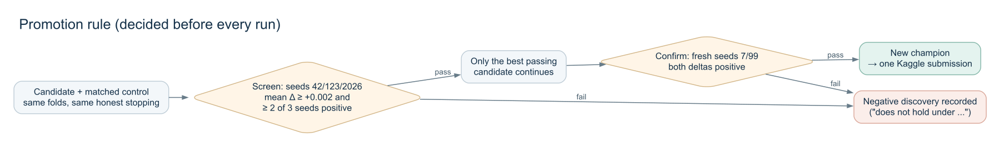

# 01. 실험 설계

[프로젝트 홈](../README.md) / [단계별 기록](02-experiment-journey.md) / [검증과 무결성](03-validation-and-integrity.md)

## 목표

[Spaceship Titanic](https://www.kaggle.com/competitions/spaceship-titanic)은 승객 정보로 `Transported`(다른 차원으로 이동했는지)를 맞히는 이진 분류 대회이고, 평가는 정확도다. 이 프로젝트의 목표는 두 가지였다.

1. **정직한 검증만으로** 점수를 얼마나 올릴 수 있는지 확인한다. 정답 조회, 외부 정답 파일, 리더보드 탐색은 처음부터 금지했다.
2. 여러 AI 코딩 에이전트가 하나의 연구 규약을 공유할 때 실험이 얼마나 체계적으로 이어지는지 기록한다.

중간에 목표 점수를 공개 노트북 최고점(0.81833)에서 0.83으로 올렸지만, 이는 방향을 정하는 목표치였을 뿐 검증 규칙을 완화하는 근거로 쓰지 않았다.

## 데이터

| 파일 | 크기 | 비고 |
|---|---|---|
| `train.csv` | 8,693 × 14 | `Transported` True 4,378 / False 4,315 |
| `test.csv` | 4,277 × 13 | 라벨 없음 |
| `sample_submission.csv` | 4,277 × 2 | |

`PassengerId` 는 `gggg_pp` 형식이고 앞 4자리가 여행 그룹이다. train에는 6,217개, test에는 3,063개 그룹이 있고 **두 파일이 공유하는 그룹은 0개**다 (D-D-004). 그래서 같은 그룹이 학습과 검증에 나뉘면 test 상황보다 쉬운 문제가 된다. 검증은 처음부터 그룹 단위로 나눴다.

## 피처 (baseline, 23개)

모든 실험이 공유한 기본 피처셋이다. `Transported` 를 읽는 피처는 없다.

| 묶음 | 피처 |
|---|---|
| 원본 | HomePlanet, CryoSleep, Destination, Age, VIP, RoomService, FoodCourt, ShoppingMall, Spa, VRDeck |
| 승객 ID | GroupMember (그룹 안 순번) |
| 객실 | CabinDeck, CabinNum, CabinSide (`Cabin` = deck/num/side) |
| 지출 | TotalSpend, NoSpend, SpendMissingCount |
| 나이 | IsChild (<13), IsTeen (13–17), IsAdult (≥18) |
| 그룹·가족 | GroupSize, SurnameSize, IsAlone |

`GroupSize` 와 `SurnameSize` 는 train과 test의 **입력 행 전체**에서 센다. 라벨을 쓰지 않는 transductive 계산이고, 공식 파일에 보이는 정보만 사용한다. 범주형 6개는 각 학습 fold 안에서만 인코더를 학습한다.

여러 확장 피처셋(결측 의미 보정, 지출 구성, 그룹 동료 요약, CryoSleep 규칙, 위치 추정, 성씨 범주, KNN 거리)을 시험했지만 승격된 것은 없었다. 최종 모델도 이 23개를 그대로 쓴다.

## 검증 계약

| 항목 | 규칙 |
|---|---|
| 분할 | `StratifiedGroupKFold(5, shuffle=True)`, 그룹 = `PassengerId` 앞 4자리, fold 배정은 `data/processed/`에 고정 저장 |
| 학습 fold 안에서만 | 범주 인코더, 스케일러, 조기종료용 slice (`StratifiedGroupKFold(8)` 의 1/8), 반복 수·에폭 선택, 스태커 학습 |
| 채점 fold | 예측만 한다. 조기종료, 임계값, 블렌드 가중치, 피처 선택에 쓰지 않는다 |
| 스택 | fold *k* 의 스태커는 나머지 4개 fold의 OOF로만 학습 (nested) |
| 지표 | 임계값 0.5의 정확도가 기준. log loss와 세그먼트 오류(Earth/non-Earth 등)는 진단용 |

초기 CatBoost 기준선은 채점 fold로 조기종료를 하고 있었다. 이것이 OOF를 약 0.004 부풀린다는 것을 확인한 뒤(D-D-026), 모든 이후 실험은 정직한 방식(학습 fold 안의 inner-CV로 반복 수 선택)을 썼다.

## 승격 규칙

| 단계 | 조건 |
|---|---|
| Screen | 같은 조건의 대조군과 SGKF seed **42 / 123 / 2026** 에서 비교. 평균 정확도 차이 **≥ +0.002** (약 18행), 3개 seed 중 **2개 이상** 개선 |
| 선택 | 여러 후보가 통과하면 평균이 가장 큰 하나만 다음 단계로 |
| Confirm | 선택에 쓰지 않은 새 seed **7 / 99** 에서 두 차이가 모두 양수 |
| 승격 | 새 챔피언으로 기록하고 Kaggle에 한 번 제출 |

+0.002는 통계적 유의성을 보장하는 값이 아니라 실용적인 문턱이다. 한 split의 부트스트랩 신뢰구간이 0을 제외해도 다른 seed에서 뒤집히는 사례(D-D-022)를 겪은 뒤, 단일 split 판단을 버리고 이 규칙을 도입했다 (2026-10-05).

## 역할

| 주체 | 역할 |
|---|---|
| 사람 | 목표와 규칙 설정, 패키지 설치와 제출 승인, 방향 전환 지시 |
| Codex | 초기 환경, 데이터 감사, CatBoost 기준선, 공개 노트북 감사, 검증 계약 (슬롯 D, 당시 이름 Main) |
| Claude Code | 대부분의 실험: 정직한 조기종료, TabPFN 도입, 파인튜닝, 스태커, 최신 모델 비교, 재검토 (슬롯 D → A) |
| ChatGPT | 다른 호스트의 발견을 재검토하는 항목 등록 (슬롯 C), 이후 사용자 지시로 Claude Code가 인계 |

에이전트는 생존 여부를 "추측"하지 않는다. 모든 예측은 로컬 Python에서 학습한 모델이 만들었고, 에이전트는 코드 작성과 실행, 결과 해석을 맡았다.

## 측정한 것과 하지 못한 것

| 측정함 | 측정하지 못함 |
|---|---|
| 그룹 단위 5-fold OOF 정확도 (seed 5개 이상) | (해당 없음: 리더보드가 test 전체로 계산되어 숨겨진 private 점수가 없음) |
| 대조군 대비 paired 차이, seed별 방향 | 통계적 유의성 (seed 간 행이 겹쳐 독립 표본이 아님) |
| 세그먼트별 오류, 오류의 지속성 | 다른 하드웨어에서 TabPFN 파인튜닝의 정확한 재현 (GPU 비결정성) |
| train/test 분포 차이 (adversarial validation) | LLM 사전학습 데이터에 이 대회 정보가 있었는지 |
