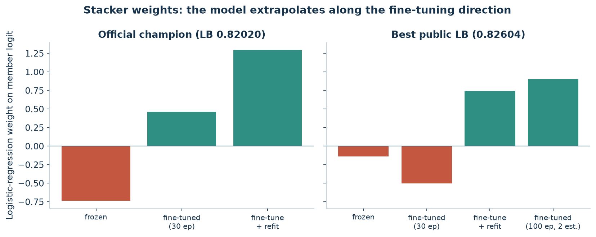
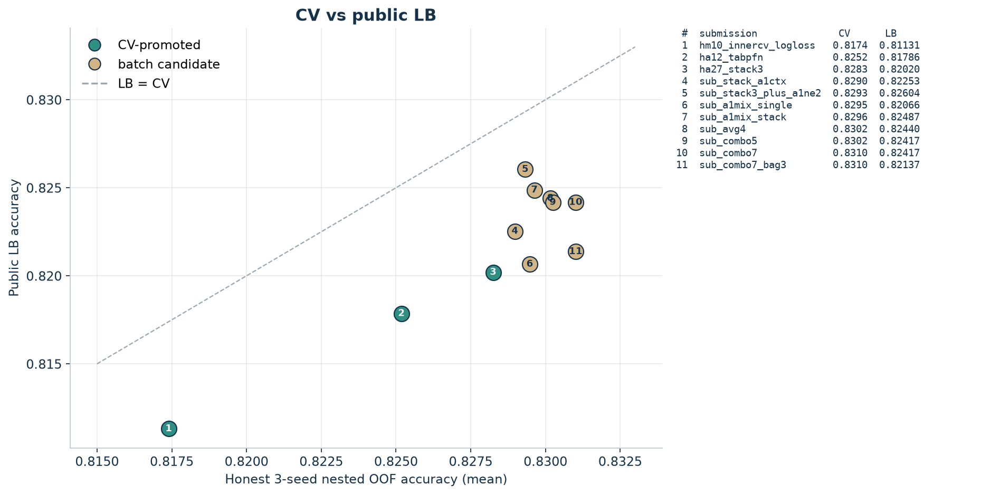
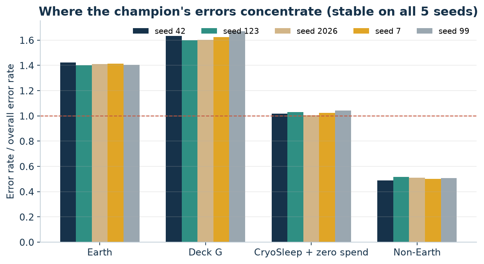
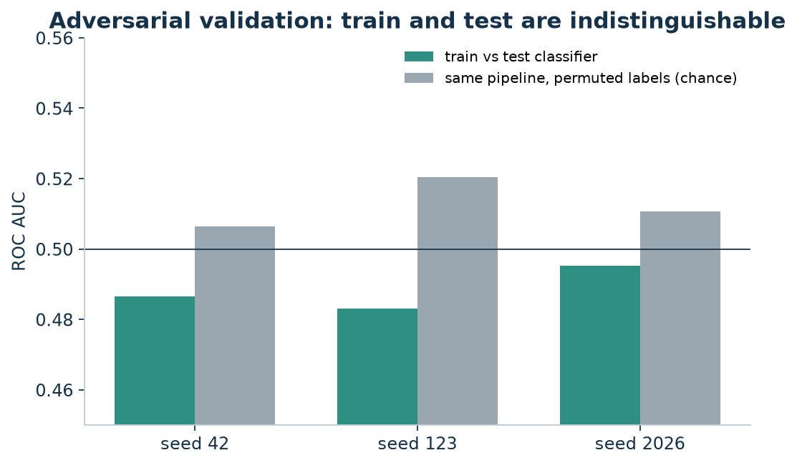

# 02. 단계별 실험 기록

[프로젝트 홈](../README.md) / [실험 설계](01-experiment-design.md) / [검증과 무결성](03-validation-and-integrity.md)

각 단계는 "무엇을 가정했고, 어떻게 쟀고, 결과가 어땠고, 그래서 무엇을 결정했는지"로 정리했다. 괄호 안의 `D-…` 는 [discoveries.md](../discoveries.md)의 발견 번호다. 모든 차이는 같은 조건의 대조군과 비교한 **paired 정확도 차이**이고, 특별한 말이 없으면 SGKF seed 42 / 123 / 2026의 평균과 개선된 seed 수다.

> **제출 횟수:** 이 기록 전체에서 Kaggle 제출은 **12번**이다. 1번째 0.80780(기준선), 2번째 0.81131, 3번째 0.81786, **4번째 0.82020** 은 모두 CV 규칙을 통과한 모델을 한 번씩 제출한 것이고, 나머지 8번은 마지막에 CV 순위 후보를 한 번에 제출한 것이다.

## 0. 환경과 데이터 감사

| 확인 | 결과 |
|---|---|
| 데이터 크기와 균형 (D-D-003) | train 8,693행, 타깃 50.4% True |
| 그룹 구조 (D-D-004) | 6,217 / 3,063 그룹, train-test 공유 그룹 0 → **그룹 단위 CV가 기본 계약** |
| 결측 의미 (D-D-009, D-D-010) | 지출 결측을 0으로 채우면 "모름"과 "안 씀"이 섞임, 이름 결측은 가짜 대가족 1개(294명)로 뭉침 |
| 규칙성 (D-D-011) | CryoSleep=True 또는 13세 미만은 지출이 0보다 큰 경우가 없음 |

## 1. CatBoost 기준선과 검증 수리

### 첫 기준선 (Public 0.80780)

CatBoost를 5-fold SGKF로 학습해 OOF 0.818820, Public 0.80780을 얻었다 (D-D-005, D-D-006). CV와 LB 차이가 −0.011로 컸고, 오류의 73%가 Earth 승객에 몰려 있었다 (D-D-008).

### 결측 보정과 확장 피처: 효과 없음

| 시도 | 결과 |
|---|---|
| 이름·지출 결측 의미 보정 (D-D-013) | +0.0014 (seed 42 하나), 부트스트랩 구간이 0 포함 |
| v2 지출 구성·그룹 동료 요약·객실 위치 (D-D-014) | 기준선과 같거나 낮음 |
| Logloss 조기종료, LightGBM, XGBoost, 동일 가중 블렌드 (D-D-015) | 모두 기준선 이하 |

### 한 split은 믿을 수 없다 (D-D-022)

CatBoost 깊이·L2 그리드의 1위는 seed 42에서 +0.0053이었고 부트스트랩 신뢰구간도 0을 제외했다. 하지만 seed 123에서 −0.0039로 뒤집혔다. 그래서 **3개 seed screen + 새 seed 2개 confirm** 규칙을 도입했다 ([실험 설계](01-experiment-design.md)).

### 채점 fold로 조기종료하면 0.004 부풀려진다 (D-D-026 → D-D-027)

기준선은 Accuracy로 조기종료하면서, 그 조기종료 기준이 **채점하는 fold** 였다. 같은 설정을 고정 300회로 바꾸자 정확도가 seed 평균 −0.0044 떨어졌다. 이후 대조군과 후보 모두 정직한 방식으로 바꿨다.

| 반복 수 선택 방식 | seed 42 / 123 / 2026 | 판정 |
|---|---|---|
| 고정 300회 (정직한 대조군) | 0.8159 / 0.8135 / 0.8132 | |
| **inner-CV Logloss** (학습 fold 안 4-fold의 최적 반복 수 중앙값) | 0.8159 / 0.8178 / 0.8185 | +0.0032, 새 seed 7/99도 +0.0023 / +0.0015 → **승격** |

정직한 CV는 숫자가 낮아졌지만, 이 챔피언의 Public은 **0.81131** 로 올랐고 CV-LB 차이가 −0.011에서 −0.0046으로 줄었다 (D-D-028). 낮아진 CV가 리더보드와 맞는 CV였다.

## 2. 피처와 모델을 바꿔도 CatBoost는 움직이지 않았다

정직한 챔피언(`hm10_innercv_logloss`)을 대조군으로 다음을 모두 시험했다. 승격된 것은 없다.

| 범주 | 시도 | 평균 차이 (개선 seed) | 발견 |
|---|---|---|---|
| 피처 | v1/v2 피처, 깊이/L2 변경 (정직한 조기종료로 재시험) | +0.0007 이하 | D-D-034 |
| 피처 | 기본 피처 묶음 제거 | 개선 없음, 위치 피처가 가장 중요 | D-D-030 |
| 피처 | 성씨를 범주로 (fold 안 ordered target statistics) | −0.0016 (0/3) | D-A-006 |
| 피처 | 그룹 번호·객실 점유 기반 위치 피처 | −0.0008 (0/3) | D-A-007 |
| 피처 | CryoSleep 규칙과 그룹 만장일치 채우기 | −0.0018 (0/3) | D-A-008 |
| 피처 | fold 안에서 다시 만든 KNN 거리 피처 | −0.0086 (0/3) | D-D-035 |
| 인코딩 | 원-핫 인코딩 | +0.0001 (1/3) | D-A-011 |
| 모델 | XGBoost (compact 피처) | −0.0058 (0/3) | D-D-032 |
| 모델 | HistGB / Lossguide / ExtraTrees | −0.0030 / −0.0035 / −0.0116 | D-A-009 |
| 모델 | Ordered boosting, 학습률 0.02 | −0.0011 / −0.0009 | D-A-013, D-A-016 |
| 앙상블 | seed 배깅, XGBoost 블렌드, 중첩 임계값 | +0.0006 / −0.0026 / +0.0009 | D-D-029, D-D-033 |
| 학습 신호 | 중첩 pseudo-labelling (진짜 test 미사용 시뮬레이션) | −0.0005 (1/3) | D-A-012 |
| 학습 신호 | fold 안 라벨 노이즈 제거·가중치 축소 | −0.0045 (0/3) | D-A-015 |
| 후처리 | 불확실한 예측을 그룹 동료 평균으로 교체 | −0.0020 (0/3) | D-A-004 |
| 학습 방식 | fold 전체 refit vs 5개 fold 모델 평균 | +0.0010, 방향이 seed마다 바뀜 | D-A-005 |

### 공개 노트북 감사

점수 순 상위 공개 노트북 약 80개를 **실행하지 않고 코드만 읽었다** (D-D-017, D-D-018, D-A-001, D-A-003).

* 일부 고득점 노트북은 모델 예측을 **노트북에 박힌 test 길이의 비트열로 덮어쓴다** (예: 0.82137 노트북의 `use_best_public_override`). 이런 노트북은 비교 대상에서 제외했다.
* 다른 노트북은 전체 학습 라벨로 그룹 타깃 통계를 만든 뒤 CV를 하거나(검증 누출), 스태커와 임계값을 같은 OOF에서 고른다.
* "깨끗해 보이는" 최고점 노트북(Viktor, Best Score 0.81833)을 소스에서 재구현해 정직하게 검증하니 OOF 약 0.805였고, 챔피언과의 블렌드도 도움이 되지 않았다 (D-A-014).

노트북에서 얻은 아이디어는 모두 fold 안 계산으로 다시 만들어 위 표에서 시험했다.

### 오류는 신호의 한계에 가까웠다 (D-A-010)

챔피언의 OOF를 seed 5개로 보면, 한 번이라도 틀린 행의 66%가 **5번 중 4번 이상** 틀렸다. 이 지속 오답은 0.5에서 평균 0.186 떨어진 확률로 자신 있게 틀렸고, split마다 바뀌는 오답은 0.5 근처(0.037)에 있었다. 피처를 더 다듬어도 바뀌지 않는 오류라는 뜻이다.

## 3. 테이블 파운데이션 모델: TabPFN v3.5 (Public 0.81786)

사용자 요청으로 최신 테이블 파운데이션 모델을 시험했다. TabPFN v3.5는 **학습 데이터를 context로 넣고 바로 예측**하는 사전학습 모델이다. 같은 23개 피처, 같은 fold, fold 안 ordinal 인코딩으로 넣었다.

| 모델 | seed 42 / 123 / 2026 | 판정 |
|---|---|---|
| CatBoost 챔피언 | 0.8159 / 0.8178 / 0.8185 | |
| **TabPFN v3.5** | 0.8262 / 0.8250 / 0.8243 | +0.0078 (3/3), 7/99도 개선 → **승격**, Public **0.81786** (D-A-017) |

TabPFN을 중심으로 다시 시험한 것들이다. 대조군은 frozen TabPFN v3.5이다.

| 시도 | 평균 차이 (개선 seed) | 발견 |
|---|---|---|
| CatBoost 블렌드 | −0.0020 (0/3) | D-A-018 |
| TabPFN v2.5 / TabICL | −0.0075 / −0.0183 | D-A-019 |
| 다른 피처셋 (v1 규칙, v1 지출, 최소 피처) | −0.0007 ~ −0.0048 | D-A-020 |
| 내부 앙상블 32개 | +0.0002 (1/3) | D-A-022 |
| fold 전체를 context로 (5개 평균 대신) | +0.0014 (3/3), 기준 미달 | D-A-021 |
| **fold 안 파인튜닝** (≤30에폭, lr 1e-5, 그룹 slice로 조기종료) | +0.0020 (3/3), 기준에 근소 미달 | D-A-023 |
| 파인튜닝 후 fold 전체로 refit | +0.0008 (3/3), log loss는 최고 | D-A-024 |
| frozen + 파인튜닝 동일 가중 블렌드 | +0.0019 (3/3) | D-A-025 |

파인튜닝은 새 seed 5개(11/13/17/19/23)를 더해도 8개 seed 모두에서 양수였지만, 평균은 약 +0.002로 문턱에 걸쳐 있었다 (D-A-026). 사후에 고른 결과로 규칙을 굽히지 않기 위해 이 결정은 사용자에게 넘겼다.

## 4. Nested 스태커 (Public 0.82020, 공식 챔피언)

동일 가중 블렌드는 이미 시험했으니, 아직 하지 않은 **학습된 결합기**를 시도했다. frozen, 파인튜닝, 파인튜닝 후 refit 세 멤버의 OOF 확률을 logit으로 바꾸고, 로지스틱 회귀(C=1)로 결합했다. fold *k* 의 스태커는 나머지 4개 fold의 OOF로만 학습한다.

| 멤버 구성 | screen 평균 차이 | 판정 |
|---|---|---|
| **TabPFN 3종** | +0.0031 (3/3) | 새 seed 7 / 99: +0.0033 / +0.0053 → **승격**, Public **0.82020** (D-A-027) |
| 3종 + CatBoost | +0.0030 (3/3) | 3종보다 낮음 |
| 10개 멤버 (다른 모델 계열 포함) | +0.0019 | 탈락 |

스태커 가중치는 frozen −0.74, 파인튜닝 +0.46, 파인튜닝 후 refit +1.29였다. frozen에 음수를 주어 **사전학습 → 파인튜닝 방향으로 한 걸음 더** 외삽하는 형태다. 다른 모델 계열을 더해도 나아지지 않았다는 점에서, 이득은 모델 다양성이 아니라 파인튜닝에서 나왔다.

## 5. 최신 모델을 스택 멤버로: 모두 실패

사용자가 가져온 2024–2026 테이블 모델 목록을 플랜으로 만들고, 단독 성능이 frozen TabPFN보다 0.003 이상 낮으면 탈락시키는 **멤버 문턱**을 미리 정했다. 통과 여부와 관계없이 스택에 넣었을 때의 효과도 기록했다.

| 모델 | 단독 (frozen TabPFN 대비) | 스택에 추가 (챔피언 대비) | 발견 |
|---|---|---|---|
| TabPFN + 성씨·객실 원문 문자열 | −0.0015 | −0.0004 | D-A-028 |
| xRFM | −0.0292 | (문턱 미달) | D-A-029 |
| Causilo | −0.0052 | −0.0005 | D-A-030 |
| TabDPT (실데이터 사전학습) | −0.0086 | +0.0001 | D-A-031 |
| RealMLP / TabM / TabR | −0.038 / −0.020 / −0.031 | ±0.0004 이내 | D-A-032 |
| TabSTAR (텍스트 인식 LoRA) | −0.0160 | −0.0004 | D-A-033 |
| 기존 frozen 변형 6종 (피처셋, v2.5, TabICL 등) | | 최대 +0.0001 | D-A-037 |

Windows 환경 문제도 있었다. TabDPT는 Triton·flash attention을 꺼야 했고, TabR은 faiss-gpu 대신 정확한 torch L2 검색으로 바꿨다. TabSTAR는 transformers 5와 충돌해 별도 가상환경에서 4.x로 돌렸다. 모두 결과에는 영향이 없는 실행 환경 조정이다.

### Playground Series 상위권 기법 조사 (D-A-034)

최근 Playground Series 상위 솔루션(S4E10–S6E8)을 조사해, 아직 시도하지 않은 기법 두 가지를 가져왔다.

| 시도 | 결과 | 발견 |
|---|---|---|
| 스택 위의 비선형 보정 (CatBoost 잔차 부스팅) | −0.0024 (0/3) | D-A-035 |
| 세그먼트 상호작용을 넣은 LR 스태커 | −0.0004 (0/3) | D-A-035 |
| Field-aware FM 멤버 (TabPFN과 상관 0.93) | −0.0004 (1/3) | D-A-036 |

상관이 낮은 모델을 더해도 도움이 되지 않았다. 남은 오답이 모든 모델에서 겹치기 때문이다. Playground에서 효과가 컸던 "original dataset 추가" 기법은 이 대회에 원본 데이터가 없어 쓸 수 없었다.

## 6. 파인튜닝을 더 깊게

| 시도 | 결과 | 발견 |
|---|---|---|
| 파인튜닝 시드 배깅 (멤버 추가) | −0.0002 (1/3) | D-A-039 |
| 100에폭·patience 20 (A1) 멤버 | +0.0003 (1/3), log loss 최고 0.347 | D-A-042 |
| 학습률 3e-5 (A2) 멤버 | +0.0003 (2/3) | D-A-042 |
| A1 + 추론 estimator 2개 (학습 때와 같은 수) | **+0.0011 (3/3)**, 기준 미달 | D-A-042 |
| A1 + fold 전체 context | +0.0008 (2/3) | D-A-042 |

TabPFN 패키지 소스를 확인해 보니 6천 행 규모에서는 에폭당 그래디언트 스텝이 1번이고, 기본 파인튜닝은 최대 30스텝을 cosine 스케줄로 감쇠시킨다. 학습을 늘리면 log loss는 좋아졌지만, 틀리는 행은 그대로였다.

## 7. 작은 개선을 모은 일괄 제출 (최고 Public 0.82604)

3개 seed에서 방향은 일관되지만 기준에 못 미친 개선을 조합해 보자는 사용자 제안에 따라, 조합 11개를 screen seed에서 비교했다. 하나(+0.0028, 3/3)가 screen을 통과했지만 **11개 중 사후에 고른 것**이라 새 seed 확인이 필요했다 (H-A-47, 미완료).

남은 제출 횟수 8회는 "점수가 높을 것 같은 순서로 후보를 골라 모두 제출하라"는 사용자 지시에 따라 **CV 순위대로 한 번에** 썼다 (D-A-043).

| CV 순위 | 후보 | CV (3 seed 평균) | Public |
|---|---|---|---|
| 1 | 챔피언 + 작은 개선 4개 (`sub_combo7`) | 0.8310 | 0.82417 |
| 1 | 같은 모델, test 예측 3 seed 배깅 (`sub_combo7_bag3`) | 0.8310 | 0.82137 |
| 2 | 챔피언 + A1-ne2 + A1-ctx (`sub_combo5`) | 0.8302 | 0.82417 |
| 3 | 평균 파인튜닝 멤버 조합 (`sub_avg4`) | 0.8302 | 0.82440 |
| 4 | A1 변형 평균으로 교체 (`sub_a1mix_stack`) | 0.8296 | 0.82487 |
| 5 | A1 변형 평균 단독 (`sub_a1mix_single`) | 0.8295 | 0.82066 |
| 6 | **챔피언 + A1-ne2** (`sub_stack3_plus_a1ne2`) | 0.8293 | **0.82604** |
| 7 | A1-ctx로 교체 (`sub_stack_a1ctx`) | 0.8290 | 0.82253 |

8개 모두 공식 챔피언(0.82020)보다 높았으므로, 파인튜닝 변형을 더하는 방향 자체는 리더보드에서도 일관됐다. 하지만 같은 모델의 test 배깅 버전끼리도 0.0028 차이가 날 만큼 순서는 노이즈 범위였다. 그래서 LB 최고값으로 챔피언을 바꾸지 않았다. 공식 챔피언은 규칙대로 `ha27_stack3`(0.82020)이고, 0.82604는 최고 제출 기록으로 따로 남겼다.

## 8. 재검토 (다른 호스트의 대기열 인계)

ChatGPT 슬롯이 등록한 재검토 항목을 사용자 지시로 Claude Code가 이어받아 진행했다.

| 대상 | 방법 | 결론 |
|---|---|---|
| D-D-021 "Logloss 모델은 Earth 정확도를 non-Earth와 맞바꾼다" | 정직한 OOF로 seed 3~5개 재검사 | 맞바꿈 방향 0/3, 1/5 → **CHALLENGED**. Earth 1.4×, Deck G 1.6× 오류 집중은 5/5 seed에서 안정 (D-A-038) |
| D-D-031 "train/test 분포 차이 없음" | adversarial validation 3 seed + 라벨 순열 기준선, 행별 OOF 저장 | AUC 0.483–0.495 vs 순열 0.506–0.520 → **VERIFIED** (D-A-040) |
| D-D-019 / D-D-028 점수 출처 | Kaggle API 제출 목록, 공개 노트북 페이지 | 우리 제출 점수와 Viktor 0.81833(V242) 확인 → **VERIFIED** (D-A-041) |

## 중단 시점에 남은 가설

연구는 사용자 요청으로 중단했다. [plan.md](../plan.md)에 남은 항목과 [handoff.md](../handoff.md)의 이어받기 명령이 있다.

| 항목 | 내용 |
|---|---|
| H-A-47 | 작은 개선 조합(`combo7`)을 새 seed 7/99로 확인 |
| H-A-40 / H-A-41 | 기본 파인튜닝 레시피에서 fold 전체 context, 추론 estimator 수 맞추기 |
| H-A-42 | refit 멤버의 학습률 스케줄 불일치 수정 + inner-CV 중앙값 에폭 |
| H-A-45 | 학습 데이터 비율별 학습 곡선 (데이터 한계인지 확인) |
| H-A-34 / H-A-38 | AutoGluon extreme, 스택 전체 full-train refit |
