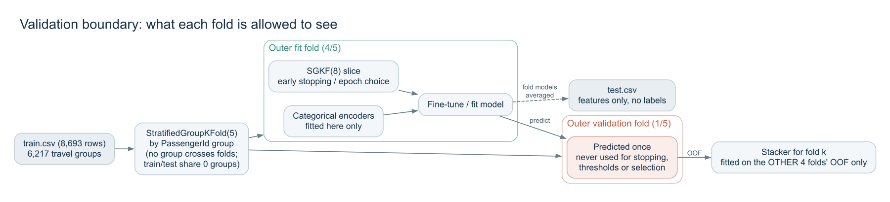

# 03. 검증과 무결성

[프로젝트 홈](../README.md) / [실험 설계](01-experiment-design.md) / [단계별 기록](02-experiment-journey.md)

이 프로젝트는 **데이터 누출, 치팅, 리더보드 탐색(LB probing), 과적합 없이** 점수를 올리는 것을 규칙으로 고정하고 시작했다. 이 문서는 그 규칙을 어떻게 지켰는지와, 그래도 남는 한계가 무엇인지를 함께 기록한다. 점수를 돋보이게 하려는 문서가 아니라 결과를 어디까지 믿어도 되는지 판단할 수 있게 하는 문서다.

## 요약

| 질문 | 답 | 근거 |
|---|---|---|
| test 정답이나 복구된 라벨을 썼나? | **아니요.** | 모든 학습은 `train.csv` 라벨만 사용. 외부 정답·제출 파일을 읽는 코드 없음 |
| 다른 사람의 예측을 섞었나? | **아니요.** | 공개 노트북은 실행하지 않고 코드만 읽었고, 예측 파일을 가져오지 않음 |
| 리더보드 점수로 모델이나 행을 골랐나? | **아니요.** | 전체 12회 제출. 챔피언은 CV 규칙 통과 뒤 한 번씩 제출(0.82020은 4번째 제출). 제출 점수를 학습이나 선택에 다시 넣지 않음 |
| 검증 라벨이 학습에 섞였나? | **아니요.** | 그룹 단위 SGKF. 인코딩·조기종료·에폭 선택·스태커가 모두 학습 fold 안 |
| CV가 낙관적이지 않나? | **스스로 찾아서 고쳤다.** | 채점 fold 조기종료가 +0.004 부풀림을 발견하고 제거 (D-D-026) |
| 한 split에 과적합하지 않았나? | **3개 seed screen + 새 seed 2개 confirm** | 원장 44건 중 승격 3건 |
| train/test 분포 차이를 이용했나? | 차이가 없음을 확인했다 | adversarial AUC 0.483–0.495, 라벨 순열 기준선 0.506–0.520 (D-A-040) |

## 1. 정답과 외부 예측을 쓰지 않았다

* 학습에 쓰인 라벨은 `train.csv` 의 `Transported` 뿐이다. test 정답 파일, 리더보드에서 역산한 라벨, 다른 사람의 제출 CSV는 한 번도 읽지 않았다.
* 고득점 공개 노트북 일부는 모델 예측을 **노트북에 박혀 있는 test 길이의 비트열로 덮어쓴다** (D-D-017). 출처를 확인할 수 없는 예측이라, 이런 노트북은 아이디어도 가져오지 않았다.
* 공개 노트북은 **실행하지 않고 정적으로 읽기만** 했다. 그중 아이디어가 있는 것은 우리 fold 안 계산으로 다시 구현해 시험했다. 예를 들어 Viktor의 노트북은 소스를 보고 재구현했다 (D-A-014).
* 외부 데이터는 사전학습된 모델 가중치뿐이다. TabPFN은 합성 데이터로 사전학습됐고, TabDPT는 공개 실데이터 테이블로 사전학습됐다. 어느 쪽도 이 대회의 `Transported` 를 담고 있지 않다.

## 2. 리더보드를 탐색하지 않았다

| # | 제출 | Public | 제출 이유 |
|---|---|---|---|
| 1 | CatBoost 기준선 | 0.80780 | 첫 기준선 |
| 2 | 정직한 조기종료 CatBoost | 0.81131 | screen + confirm 통과 후 승격 |
| 3 | TabPFN v3.5 | 0.81786 | screen + confirm 통과 후 승격 |
| 4 | **TabPFN 3종 nested 스택** | **0.82020** | screen + confirm 통과 후 승격 |
| 5–12 | CV 순위 후보 8개 | 0.82066–0.82604 | 사용자 지시로 남은 제출 횟수를 CV 순위대로 한 번에 사용 |

* 1번과 4번 제출 사이에 기록된 발견만 50건이 넘지만, 제출은 CV 규칙을 통과한 모델이 나왔을 때만 했다. 리더보드 점수를 보고 피처·하이퍼파라미터·임계값을 바꾼 적이 없다.
* 5~12번은 같은 날 **한 번에** 제출했고, 그 점수를 보고 다시 제출하지 않았다. 제출 점수로 특정 행의 라벨을 추론하는 방식(행 몇 개만 바꿔 점수 변화를 보는 것)은 하지 않았다.
* 12개 제출 기록은 [Kaggle API 스냅샷](evidence/kaggle-submissions.csv)에, 제출 파일과 해시는 [submissions/](../submissions/)와 [manifest](evidence/submission-manifest.json)에 있다.

## 3. 검증 경계

| 경계 | 지킨 방법 |
|---|---|
| 그룹 | `PassengerId` 앞 4자리 그룹 단위로 fold를 나눴다. train과 test가 공유하는 그룹이 0개이므로, 그룹을 나누지 않으면 test보다 쉬운 검증이 된다 |
| 인코더 | 범주 ordinal 인코더는 학습 fold의 행으로만 fit했다. 검증 fold와 test에는 transform만 했다 |
| 조기종료 | 학습 fold 안에서 다시 그룹 단위 `StratifiedGroupKFold(8)` 로 1/8 slice를 떼어 조기종료와 에폭 선택에 썼다. 채점 fold로 조기종료하는 초기 방식은 발견 후 제거했다 |
| 반복 수 | CatBoost는 학습 fold 안 4-fold inner-CV의 최적 반복 수 중앙값으로 정했다 (D-D-027) |
| 스태커 | fold *k* 의 OOF를 예측하는 로지스틱 회귀는 나머지 4개 fold의 OOF로만 학습했다. 제출용 스태커만 전체 OOF로 학습한다 |
| 임계값·가중치 | 0.5로 고정했다. 임계값이나 블렌드 가중치를 시험할 때도 다른 fold에서만 골랐다 (D-D-033) |
| pseudo-label | 진짜 test는 쓰지 않고, 학습 fold의 일부를 가린 시뮬레이션으로만 시험했다 (D-A-012) |

### transductive 계산 한 가지

`GroupSize` 와 `SurnameSize` 는 train과 test의 **입력 행을 합쳐서** 센다. 라벨은 전혀 쓰지 않는다. 대회 규칙과 프로젝트 규칙(라벨을 쓰지 않는 train+test 비지도 계산은 메커니즘을 문서화하면 허용)의 범위 안이며, 코드 주석과 이 문서에 명시했다. 성씨 정보를 학습 fold 안 target statistics로 쓰는 방식은 오히려 성능을 떨어뜨렸다 (D-A-006).

## 4. 과적합을 막은 장치

* **정직한 CV를 먼저 만들었다.** 낙관적인 CV(0.8188)를 버리고 낮은 CV(0.8159)를 받아들였더니, 그 CV를 높인 모델이 리더보드에서도 올랐다.
* **seed 여러 개.** 모든 비교는 같은 조건의 대조군과 seed 3개에서 했고, 통과하면 선택에 쓰지 않은 seed 7과 99에서 다시 확인했다. 한 split에서 부트스트랩 신뢰구간이 0을 제외한 후보가 다른 seed에서 뒤집힌 경험(D-D-022)이 이 규칙의 출발점이다.
* **하나만 확인 단계로.** 여러 후보가 screen을 통과해도 평균이 가장 큰 하나만 confirm으로 보냈다.
* **실패도 기록.** 실험마다 발견 하나를 남기고, 실패하면 "Finding: … does not hold under …" 형식으로 남겼다. 같은 아이디어를 다시 시도해 운 좋게 통과시키는 것을 막기 위해서다.
* **교차 검증.** 한 호스트가 만든 발견은 다른 호스트가 한 번 검토한다. 이 과정에서 D-D-021이 CHALLENGED로 뒤집혔다.

## 5. 그래도 남는 한계

정직하게 적어 둔다.

| 한계 | 설명 |
|---|---|
| seed 재사용 | screen seed(42/123/2026)와 confirm seed(7/99)는 연구 내내 같은 값을 썼다. 개별 실험에서는 새 seed지만, 70건 넘는 실험 전체로 보면 이 seed들에 대한 선택이 누적된다. seed가 달라도 같은 8,693행을 다시 나누는 것이므로 독립 표본이 아니다 |
| 최고 제출의 선택 | 0.82604는 CV 순위 후보 8개를 한 번에 제출한 결과 중 **최고값**이다. 8개 중 최대를 고르는 것 자체가 public LB에 대한 선택이므로, 공식 챔피언(0.82020)과 구분해서 표기했다. 최종 모델을 LB로 바꾸지 않았다 |
| 사후 조합 | 마지막 조합 후보(`combo7` 등)는 screen seed에서 11개 중 고른 것이다. 새 seed 확인(H-A-47)은 연구 중단으로 하지 못했다 |
| CV-LB 차이 | 공식 챔피언의 OOF는 약 0.828, 리더보드는 0.8202다. 리더보드는 test 전체(4,277행)로 계산되므로 정확도의 표본 표준오차는 약 0.006이다. 분포 차이는 없었으므로(D-A-040) 남은 차이는 이 표본 오차와 연구 전체의 선택 낙관으로 본다 |
| 재현성 | TabPFN 파인튜닝은 GPU 커널 때문에 장비가 바뀌면 결과가 조금씩 달라진다. 스크립트와 Kaggle 노트북은 같은 절차를 재현하지만, 소수점 넷째 자리까지 같다고 보장하지 않는다 |
| 교차 검증 범위 | 많은 발견이 Claude Code 한 호스트에서 만들어져 아직 PENDING 상태다. 같은 호스트의 재검토는 "same host"로 표시했다 |
| LLM 사전지식 | 에이전트가 사용한 언어 모델이 이 대회에 대해 무엇을 학습했는지는 확인할 수 없다. 다만 모든 예측은 로컬에서 학습한 모델이 만들었고, 에이전트가 행 단위로 답을 정한 적은 없다 |

## 6. 확인 방법

* [실험 원장](evidence/experiment-ledger.csv): 차트에 쓴 모든 수치와 발견 번호
* [발견 기록](../discoveries.md): 실험별 근거 파일과 교차 검증
* [reports/](../reports/): 실행별 지표 JSON (설정, 코드 해시, 원본 데이터 해시 포함)
* [데이터 지문](evidence/data-fingerprints.json): 사용한 공식 CSV의 SHA256
* `python tools/verify_publication.py`: 증거 파일 해시, 제출 파일 형식, 문서 링크 확인
