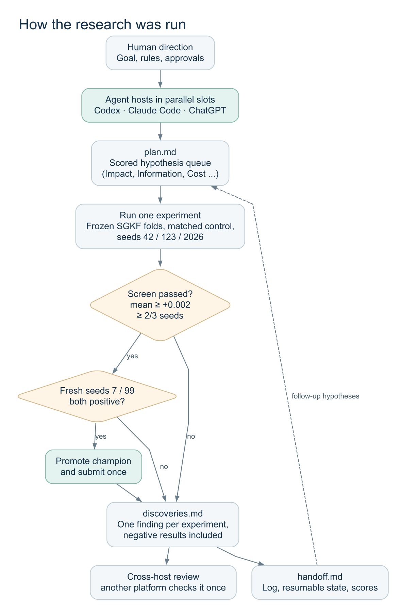

# 04. 작업 방식과 에이전트

[프로젝트 홈](../README.md) / [실험 설계](01-experiment-design.md) / [검증과 무결성](03-validation-and-integrity.md)

## 연구 규약: research-orchestrator

여러 에이전트가 같은 저장소에서 일하면 같은 실험을 반복하거나, 이미 실패한 아이디어를 다시 시도하거나, 서로의 결론을 검증 없이 믿기 쉽다. 이를 막기 위해 `research-orchestrator` 라는 작업 규약을 스킬로 만들어 모든 에이전트가 따르게 했다. 규약은 저장소 루트의 네 파일로만 이루어진다.

| 파일 | 역할 |
|---|---|
| [agents.md](../agents.md) | 고정 규칙: 슬롯 이름, 읽는 순서, 무결성 규칙, 검증 계약, 승격 규칙, 우선순위 계산식 |
| [plan.md](../plan.md) | 아직 끝나지 않은 가설만 담는 큐. 에이전트별 섹션, 항목마다 점수 |
| [discoveries.md](../discoveries.md) | 실험마다 하나씩 남기는 발견. 실패는 "does not hold under …" 형식. 다른 호스트가 한 번 검토 |
| [handoff.md](../handoff.md) | 공유 상태(현재 챔피언), 완료 로그, 에이전트별 이어받기 상태 |



### 가설의 우선순위

모든 가설은 여섯 항목을 0–3으로 매기고 다음 식으로 정렬했다.

```text
Priority = 2*Impact + 2*Information + Confidence + Unblock + Diversity + (3 - Cost)
```

가설을 추가하기 전에는 중복 검사를 거친다. `discoveries.md` 의 실패 기록, 완료 로그, 다른 에이전트의 가설 제목을 확인해 같은 아이디어가 이미 있으면 추가하지 않는다. 다시 시도하려면 이전 시도와 무엇이 다른지(`Improvement`)를 적어야 한다.

### 실험이 끝나면

한 번에 다음 순서로 처리한다: 발견 기록 → 로그 이벤트 → 후속 가설 등록 → 완료된 가설을 큐에서 제거. 큐에는 "완료" 표시가 남지 않고, 끝난 일은 모두 `discoveries.md` 로 옮겨진다. 그래서 `discoveries.md` 가 "이미 결론난 아이디어의 목록" 역할을 한다.

## 멀티 에이전트 운영

에이전트 이름은 모델이 아니라 **작업 슬롯**이다 (A, B, C, D …). 어떤 호스트든 슬롯을 이어받을 수 있고, 지금 누가 슬롯을 쓰는지는 `handoff.md` 의 `Current host` 에 적는다.

| 슬롯 | 호스트 | 한 일 |
|---|---|---|
| D (당시 `Main`) | Codex → Claude Code | 환경, 데이터 감사, CatBoost 기준선, 공개 노트북 감사, 정직한 조기종료, seed 규칙 |
| A | Claude Code | 공개 노트북 아이디어 검증, TabPFN, 파인튜닝, 스태커, 최신 모델, Playground 기법, 재검토 인계 |
| B | Claude Code | 사용자 EDA를 가설로 정리 (진행하지 않은 CatBoost 범주 조합 1건 남음) |
| C | ChatGPT | 다른 호스트의 발견을 재검토하는 항목 4건 등록 → 사용자 지시로 A가 인계해 수행 |

같은 플랫폼(예: Claude Code)이면 모델(Opus, Fable, Sonnet)이 달라도 같은 호스트로 본다. 같은 호스트의 세션끼리는 같은 맹점을 공유하므로 서로의 발견을 교차 검증하지 않는다. 다른 호스트가 없어서 같은 호스트가 재검토한 경우에는 `same host —` 로 표시했다.

## 사람이 결정한 것

에이전트가 스스로 정하지 않고 사람이 결정한 일들이다.

| 결정 | 시점 |
|---|---|
| 무결성 규칙(정답·누출·LB probing 금지) | 시작 |
| 3-seed screen + 7/99 confirm 규칙 채택 | D-D-022 이후 |
| 정직한 조기종료로 기준 변경 | D-D-026 이후 |
| TabPFN, torch, 최신 모델 패키지 설치 승인 | TabPFN 단계, 최신 모델 단계 |
| CV 규칙을 통과한 모델은 에이전트가 직접 제출해도 됨 | TabPFN 단계 |
| 목표 0.81833 → 0.83 상향 (목표치일 뿐 규칙 완화 아님) | 스태커 단계 |
| 작은 개선 조합 시도, 남은 제출을 CV 순위로 모두 사용 | 마지막 |
| 연구 중단과 공개 | 마지막 |

## 실제 지시 예시

* "승인할게 설치하고 진행해" → 최신 모델 패키지를 설치하고, 결과마다 발견을 기록하며 큐를 진행
* "현재까지 성과가 없다면 서로 다른 모델끼리 앙상블해보는건 어때?" → 이미 한 블렌드를 확인한 뒤 아직 안 한 형태(nested LR 스태커)를 시도 → 공식 챔피언
* "미약한 개선끼리 모으면 더 나아지지 않을까?" → 조합 11개 screen, 사후 선택임을 명시하고 확인 단계(H-A-47) 등록
* "gpt가 해야할 것도 그냥 클로드가 재검토 겸 진행해" → ChatGPT 슬롯의 재검토 4건 인계, 같은 호스트 검토는 표시

## 자동화의 범위

* 에이전트는 코드 작성, 로컬 실행, 결과 해석, 문서 기록을 했다. 예측은 모두 로컬에서 학습한 모델이 만들었다.
* 패키지 설치, 제출 규칙, 방향 전환은 사람이 승인했다.
* TabPFN 토큰 같은 비밀값은 사용자 환경변수로만 두고, 에이전트는 값을 출력하거나 파일에 쓰지 않았다.
* 승격된 모델이 나오면 알림음을 울리고, 그 외에는 큐가 빌 때까지 계속 진행하도록 설정했다.
