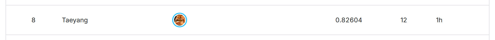

# 06. 결과와 교훈

[프로젝트 홈](../README.md) / [단계별 기록](02-experiment-journey.md)

## 최종 결과

| | 정직한 OOF (seed 42 / 123 / 2026) | Public | 제출 순서 |
|---|---|---|---|
| CatBoost 기준선 (낙관적 조기종료) | 0.8188 (seed 42, 부풀려진 값) | 0.80780 | 1번째 |
| CatBoost, 정직한 조기종료 | 0.8159 / 0.8178 / 0.8185 | 0.81131 | 2번째 |
| TabPFN v3.5 | 0.8262 / 0.8250 / 0.8243 | 0.81786 | 3번째 |
| **TabPFN 3종 nested 스택 (공식 챔피언)** | 0.8291 / 0.8288 / 0.8269 | **0.82020** | **4번째** |
| 스택 + 100에폭 파인튜닝 멤버 (최고 제출) | 0.8311 / 0.8295 / 0.8273 | **0.82604** | 5–12번째 일괄 제출 중 하나 |

전체 제출은 **12번**이었다. 공식 챔피언은 4번째 제출이고, 깨끗해 보이는 공개 노트북 최고점(0.81833)보다 높다. 최고 제출 0.82604로 2026-10-06 리더보드 **8위**였다 (리더보드는 test 전체로 계산).

## 교훈

### 1. CV를 먼저 의심하라

가장 큰 전환점은 모델이 아니라 검증이었다. 채점 fold로 조기종료를 하면 OOF가 약 0.004 부풀려졌다. 정직한 CV로 바꾸면 숫자는 낮아졌지만, 그 숫자를 올린 모델이 리더보드에서도 올랐다. 높은 CV를 지키는 것보다 **리더보드로 옮겨 가는 CV**를 갖는 것이 중요했다.

### 2. 한 split의 유의성은 믿지 마라

부트스트랩 신뢰구간이 0을 제외한 +0.005 후보가 다른 seed에서 −0.004가 됐다. 8,693행에서 몇십 행 차이는 split이 바뀌면 사라진다. seed 3개 screen과 새 seed 확인은 느렸지만, 덕분에 리더보드를 보지 않고도 승격 결정을 내릴 수 있었다.

### 3. 작은 테이블에서는 파운데이션 모델이 강하다

CatBoost를 20가지 넘게 다듬어도 얻지 못한 차이(+0.008)를 TabPFN v3.5가 기본 설정으로 만들었다. 하지만 "최신"이 곧 "더 좋음"은 아니었다. TabPFN v2.5, TabICL, TabDPT, Causilo, TabSTAR, RealMLP, TabM, TabR은 모두 TabPFN v3.5보다 낮았다.

### 4. 다양성보다 같은 모델의 다른 버전

앙상블은 서로 다른 모델을 섞어야 좋다고 흔히 말한다. 여기서는 반대였다. 상관이 낮은 FFM이나 TabDPT를 더해도 효과가 없었고, 이득은 **같은 TabPFN의 frozen과 파인튜닝 버전을 학습된 가중치로 합칠 때만** 나왔다. 남은 오답이 모든 모델에서 겹쳤기 때문이다.

### 5. 실패 기록이 탐색 비용을 줄인다

44개 아이디어 중 승격은 3개였다. 실패를 "does not hold under …" 형식으로 남겨 두니, 새로 제안된 아이디어(pseudo-labelling, 그룹 후처리 등)를 다시 돌리지 않고 기존 결과로 바로 정리할 수 있었다. 외부에서 가져온 Playground 기법 8개 중 6개도 이렇게 실험 없이 걸러졌다.

### 6. 리더보드는 마지막에, 한 번에

마지막 8개 후보는 모두 챔피언보다 높았지만, 같은 모델의 두 버전도 0.0028 차이가 났다. 리더보드를 보며 하나씩 고쳤다면 노이즈를 따라갔을 것이다. 후보를 CV로 정하고 한 번에 제출했기 때문에, 결과를 "방향은 맞지만 순서는 노이즈"로 해석할 수 있었다.

## 후속 과제

| 과제 | 이유 |
|---|---|
| 조합 후보의 새 seed 확인 (H-A-47) | 사후 선택된 +0.0028이 진짜인지 확인 |
| 파인튜닝 레시피 개선 (H-A-40/41/42) | 추론 estimator 수, fold 전체 context, refit 스케줄 불일치 |
| 학습 곡선 (H-A-45) | 남은 한계가 데이터 양인지, 신호인지 구분 |
| 교차 검증 | PENDING 상태의 Claude Code 발견을 다른 호스트가 검토 |
